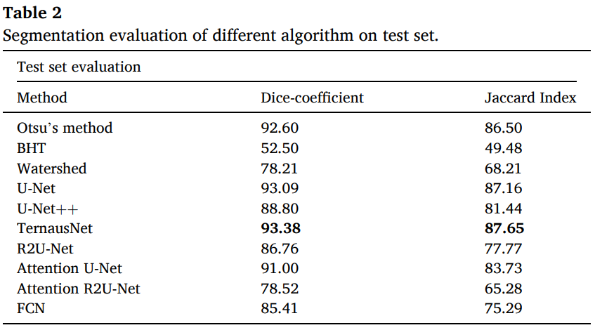

# Automatic segmentation of blood cells from microscopic slides: A comparative analysis

This codebase is part of supplementary materials of our paper *"__Automatic segmentation of blood cells from microscopic slides: A comparative analysis__"*
***

## Authors:
Deponker Sarker Depto, Shazidur Rahman, Md. Mekayel Hosen, Mst Shapna Akter, Tamanna Rahman Reme, Aimon Rahman, Hasib Zunai, M. Sohel Rahman and M.R.C.Mahdy

## Short Description:
With the advent of deep learing algorithms in medial domain, there is a need for quality and large datasets. In this work, we introduced the largest microscopic blood cell segmentation dataset and benchmark different state-of-the-art algorithms on it. Our findings and contributions are particularly helpful for researchers working in deep learning with applications in medial domain.


Figure: We have presented original blood smear image (left) and corresponding annotated segmentation mask (right).

## Published Paper Link
[Automatic segmentation of blood cells from microscopic slides: A comparative analysis](https://www.sciencedirect.com/science/article/abs/pii/S0040816621001695)

## Proposed Large Segmentation Dataset Download Link  
2656 images are avilable. 1328 Original blood cell images with 1328 corresponding ground truths.  
https://drive.google.com/file/d/1nG-ra6BPAZSTsdYCvedzCo-JLD7jdH71/view?usp=share_link


## Citation
  ```sh@article{depto2021automatic,
  title={Automatic segmentation of blood cells from microscopic slides: a comparative analysis},
  author={Depto, Deponker Sarker and Rahman, Shazidur and Hosen, Md Mekayel and Akter, Mst Shapna and Reme, Tamanna Rahman and Rahman, Aimon and Zunair, Hasib and Rahman, M Sohel and Mahdy, MRC},
  journal={Tissue and Cell},
  volume={73},
  pages={101653},
  year={2021},
  publisher={Elsevier}
}
  ```

## DOI
https://doi.org/10.1016/j.tice.2021.101653


## Codebase
https://github.com/Deponker/Blood-cell-segmentation


## Algorithms implemented

Deep learning algorithms..
- U-net
- U-net++
- Ternaus-Net
- Attention U-net
- R2U-net
- Attention R2U-net

Machine learning algorithms..
- Otsu's thresholding
- K-mean clustering

Image processing algorithms..
- Marker based watershed algorithm
- Balaced histogram thresholding


## Requirments
This work requirs
- Python:     3.8.1
- Tensorflow: 2.3.0
- Keras:      2.4.0

## Results
We report the best scores from our implemented models


## License
Distributed under the MIT License.

